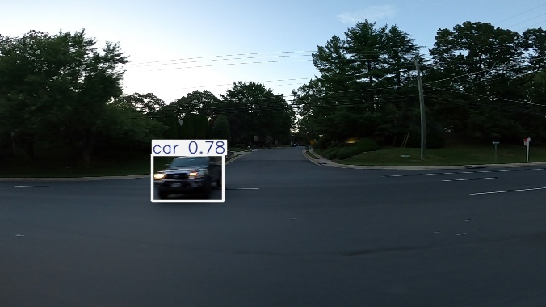

# YOLOv8 Object Detection for Self-Driving Cars

This repository demonstrates the implementation of **YOLOv8 Object Detection** for self-driving cars, enabling accurate and real-time identification of obstacles, pedestrians, vehicles, and road signs.

## Introduction

Object detection is a crucial computer vision task for self-driving cars, allowing them to perceive and interpret their environment effectively. The **YOLO (You Only Look Once) v8 model** is utilized due to its high efficiency and accuracy in detecting objects within images.

## YOLOv8 Architecture

YOLOv8 is the latest version of the YOLO family, featuring:
- **Improved backbone and neck** for better feature extraction.
- **Anchor-free detection** for more flexibility.
- **Higher accuracy and faster inference** compared to previous YOLO versions.
- **Optimized model size** for deployment in real-time applications.

## Dataset

The object detection model is trained using the **Car Object Detection** dataset from Kaggle:
- [Car Object Detection Dataset](https://www.kaggle.com/datasets/sshikamaru/car-object-detection/data)
- The dataset consists of images annotated with bounding boxes for various objects relevant to autonomous driving.

## Results

### YOLOv8 Object Detection
- **Sample Detection Result:**
  


## Getting Started

### Installation
To run YOLOv8 object detection, install the required dependencies:
```bash
pip install ultralytics opencv-python numpy matplotlib
```


## Conclusion
YOLOv8 provides a robust and efficient object detection solution for self-driving applications. Explore the repository for the full implementation and further improvements.
